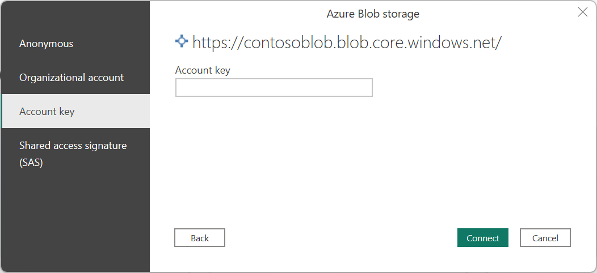
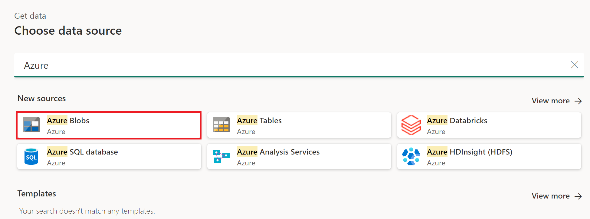

# Azure Blob Storage

## Summary

| Item | Description |
| ---- | ----------- |
| Release State | General Availability |
| Products | Excel Power BI (Semantic models) Power BI (Dataflows) Fabric (Dataflow Gen2) Power Apps (Dataflows) Dynamics 365 Customer Insights Analysis Services |
| Authentication Types Supported | Anonymous Account key Organizational account Shared access signature (SAS) Service principal |
| Function Reference Documentation | [AzureStorage.BlobContents](/powerquery-m/azurestorage-blobcontents) [AzureStorage.Blobs](/powerquery-m/azurestorage-blobs) |

> [!NOTE]
> Some capabilities may be present in one product but not others due to deployment schedules and host-specific capabilities.

## Prerequisites

* An Azure subscription. Go to [Get Azure free trial](https://azure.microsoft.com/pricing/free-trial/).

* An Azure Blob Storage account. Follow the instructions at [Create a storage account](/azure/storage/common/storage-account-create?tabs=azure-portal). This article assumes that you've already created an Azure Blob Storage account, and uploaded data files to it.

> [!NOTE]
> If you're connecting to an Azure Blob Storage account from Power BI, the Azure Blob storage account must be in the same region as your Power BI account.

## Capabilities supported

* Import

## Connect to Azure Blob Storage from Power Query Desktop

To connect to Azure Blob Storage:

1. Select **Azure Blob Storage** in the get data experience. The get data experience in Power Query Desktop varies between apps. For more information about the Power Query Desktop get data experience for your app, go to [Where to get data](../where-to-get-data.md).

2. In **Azure Blob Storage**, enter the account name or URL of your Azure Blob Storage account. Then select **OK**.

    

3. If this is the first time you're connecting to this account, select either the **Anonymous** or **Account key** authentication method to sign into the Azure Blob Storage account. More information: [Copy your account key from Azure Blob Storage](#copy-your-account-key-from-azure-blob-storage)

   

   For more information about using and managing authentication, go to [Authentication with a data source](../connectorauthentication.md).

   > [!NOTE]
   > If you are signing in from Excel, you can also select the shared access signature (SAS) authentication method.

4. Select **Connect**.

5. The **Navigator** dialog box shows the files that you uploaded to your Azure Blob Storage account. Select the containers you want to use, and then select either **Transform Data** to transform the data in Power Query or **Load** to load the data.

   

## Connect to Azure Blob Storage from Power Query Online

To connect to Azure Blob Storage:

1. Select the **Azure Blobs** option in the get data experience. Different apps have different ways of getting to the Power Query Online get data experience. For more information about how to get to the Power Query Online get data experience from your app, go to [Where to get data](../where-to-get-data.md).

   

2. In **Connection settings**, enter the account name or URL of your Azure Blob Storage account.

3. Optionally, enter the name of the on-premises data gateway you require.

4. Select the **Authentication kind** used to access your blob storage. If you've set blob storage for anonymous access, choose **Anonymous**. If you set blob storage to require an account key, choose **Account key**. More information: [Copy your account key from Azure Blob Storage](#copy-your-account-key-from-azure-blob-storage)

   

   For more information about using and managing authentication, go to [Authentication with a data source](../connectorauthentication.md).

5. Select **Next**.

6. The **Navigator** screen shows the files tht you uploaded to your Azure Blob Storage account. Select the containers you want to use, and then select **Transform data**.

   

## Copy your account key from Azure Blob Storage

To retrieve your Azure Blob Storage account key to use while authenticating your account in Power Query:

1. Sign in to the [Azure portal](https://portal.azure.com/).

2. Locate your Azure Blob Storage account.

3. In the storage account menu pane, under Security + networking, select Access keys.

   

4. In the **key1** section, locate the **Key** value. Select **Show** next to the key value.

5. Select the **Copy to clipboard** icon to copy the **Key** value.

   
