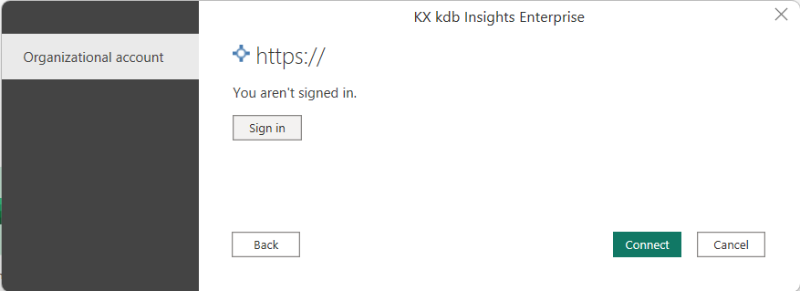
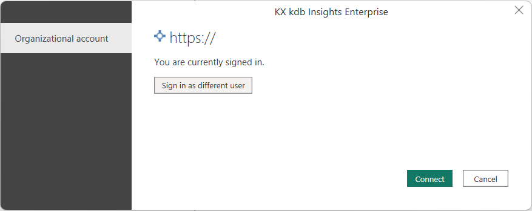
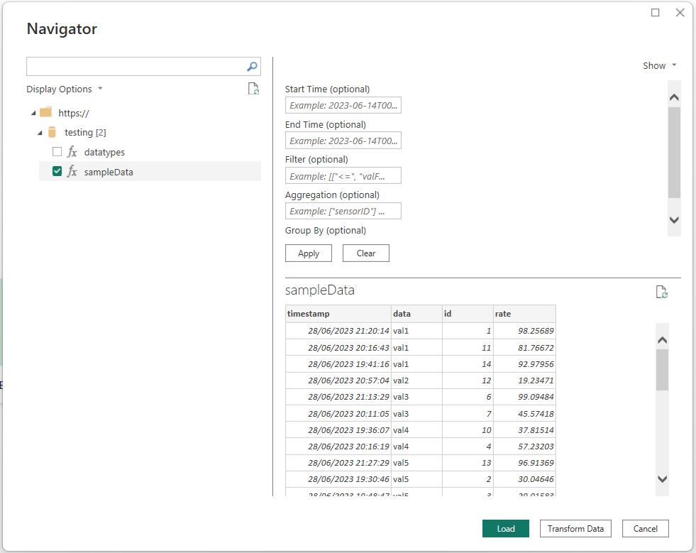

# KX kdb Insights Enterprise Power Query Connector

> [!NOTE]
> The following connector article is provided by KX Systems Inc., the owner of this connector and a member of the Microsoft Power Query Connector Certification Program. If you have questions regarding the content of this article or have changes you would like to see made to this article, visit the [KX](www.kx.com) website and use the support channels there.

## Summary

| Item	                        | Description                 |
| ------------------------------ | --------------------------- |
| Release State                  | General Availability        |
| Products                       | Power BI                    |
| Authentication Types Supported | Username/Password OAuth |

The connector enables Microsoft Power BI users to remotely connect, explore, query data, preview tables, and harness the power and performance of kdb Insights Enterprise analytics before importing datasets into Power BI for visualization.

## Prerequisites

Ensure the following prerequisities are met before proceeding:

* kdb Insights Enterprise 1.11.0 or above is [installed](https://code.kx.com/insights/enterprise/getting-started/index.html) and running at least one database.

* Permissions to query data on the running databases.

## Capabilities supported

* Import
    * Filtering
    * Aggregation
    * Group By

## Connect to kdb Insights Enterprise 

To make the connection, follow these steps:

1. Open Microsoft Power BI Desktop or Power BI Online.

1.  Select **Get Data**:
    - For **Power BI Desktop**, click `Get Data -> More` from the **Home** tab in the upper ribbon.
    - For **Power BI Online**, in the Get Data experience, select the `Dataflow` category. Refer to [Creating a dataflow](https://learn.microsoft.com/en-us/power-bi/transform-model/dataflows/dataflows-create) for instructions.

1. Search for **KX kdb**.

1. Select **KX kdb Insights Enterprise**.

1. Click **Connect**.

1. Enter the URL for your kdb Insights Enterprise deployment.

1. Click **OK**.

1. You are prompted to sign in if you have not signed in recently or have never signed in:

    - If you have not signed in recently or have never signed in click **Sign in**. The button is named **Sign in as a different user** if your login credentials have expired or are no longer valid.

   
   
1. If your credentials are valid, the Connector popup displays that you are currently signed in and you can click the **Connect** button.

   

1. The **Navigator** dialog box displays all the running databases and tables for your chosen host on the left. Clicking on a table returns a preview of the selected data using the _kdb Insights Enterprise_ [getData REST API](https://code.kx.com/insights/api/database/query/get-data.html).

   

## Navigator options

The [parameters](https://code.kx.com/insights/1.11/enterprise/integrations/powerbi/powerbi-import.html#parameters) available on the Navigator allow you to leverage the power of kdb Insights Enterprise analytics to filter, group, and aggregate data by restricting the data being loaded and bringing you the performance of the _kdb Insights database_.

    | **Parameter** | **Details**                                                                      |
    | ------------- | -------------------------------------------------------------------------------- |
    | Start Time    | Applies to the partitioned column and will be ignored for non-partitioned tables |
    | End Time      | Applies to the partitioned column and will be ignored for non-partitioned tables |
    | Filter        | Filters out certain rows                                                         |
    | Aggregation   | Filters the columns and/or aggregates the rows being returned                    |
    | Group By      | Group the results of an aggregation based on specific columns                    |

## More resources

For more information visit the following resources:

* [kdb Insights Enterprise official documentation](https://code.kx.com/insights/enterprise/index.html).

* [KX kdb Insights Enterprise Power Query Connector documentation](https://code.kx.com/insights/enterprise/integrations/powerbi/powerbi-import.html).
