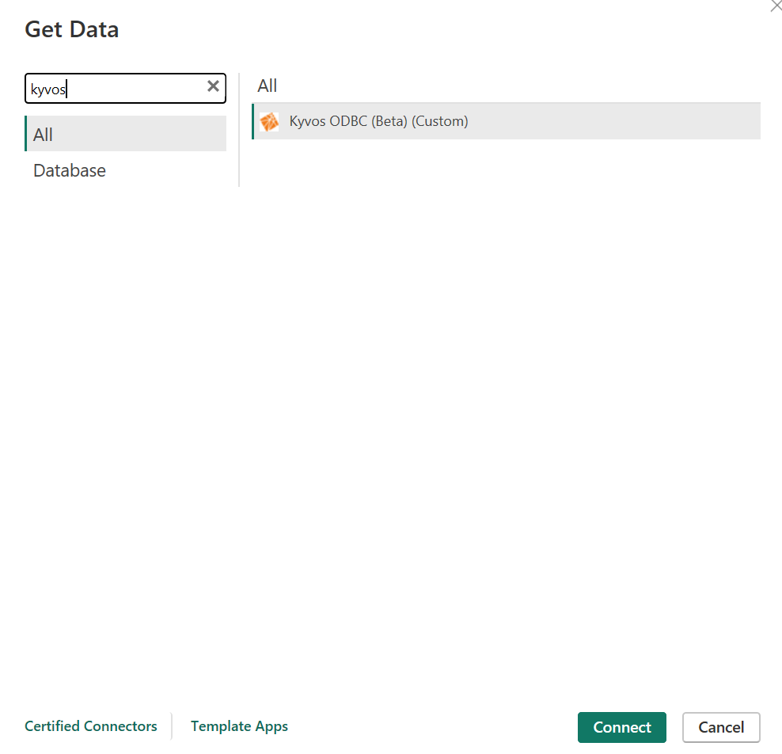
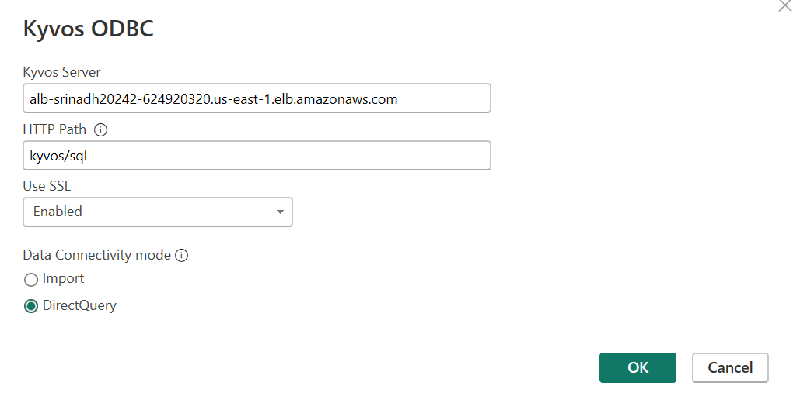
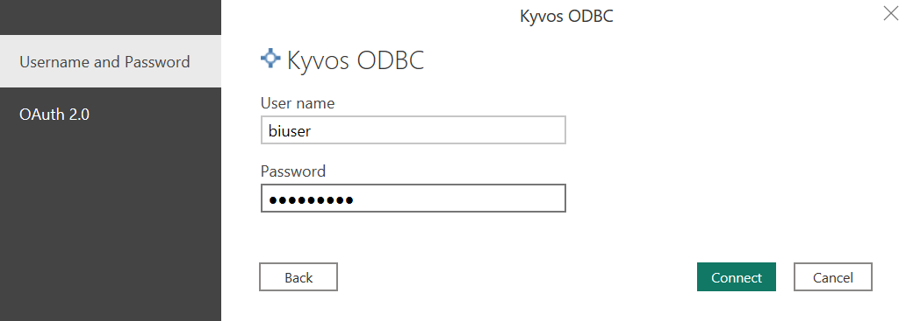
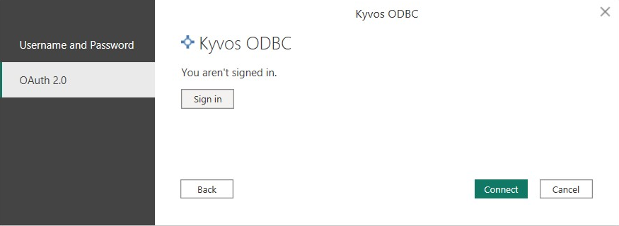
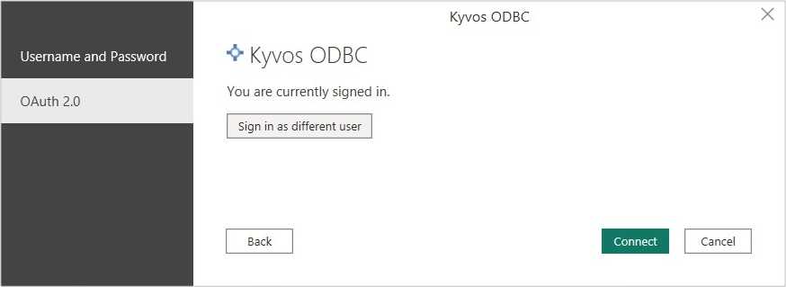
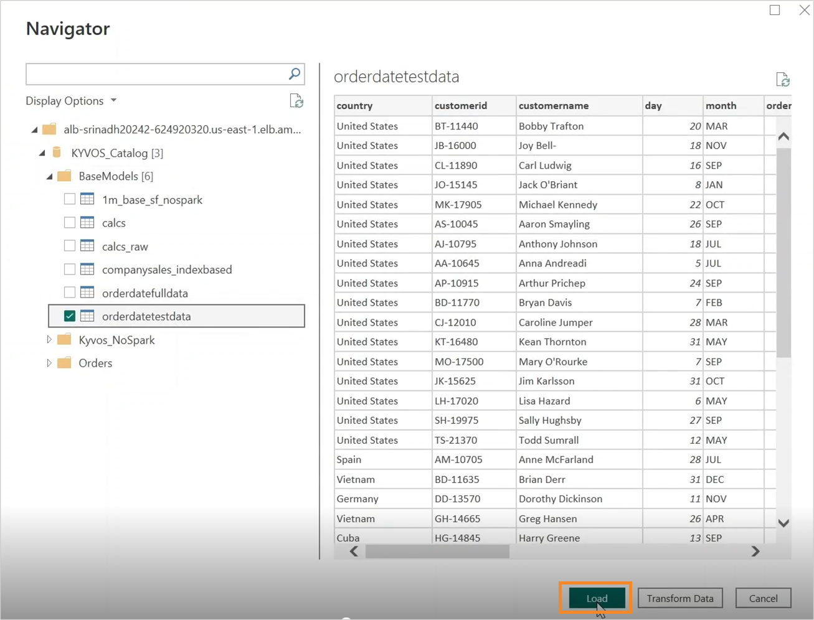
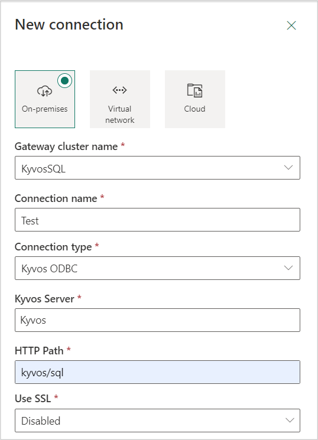

# Kyvos ODBC Connector 

> [!NOTE]
>The following connector article is provided by Kyvos, the owner of this connector and a member of the Microsoft Power Query Connector Certification Program. If you have questions regarding the content of this article or would like to see changes made to it, please write to Kyvos Support at support@kyvos.io 

## Summary 
| Item | Description |
| ------ | ------ |
|Release State | Beta |
|Products| Power BI (Semantic models), Power BI (Dataflows) |
|Authentication Types Supported| Username and Password OAuth (OIDC) |

> [!NOTE]
>Some capabilities may be present in one product but not others due to deployment schedules and host-specific capabilities.

## Prerequisites 
This connector is designed for use with Microsoft Power BI and works most effectively when the [Kyvos ODBC Driver](https://www.kyvosinsights.com/kyvos-odbc-driver/) is installed on the machine running the Power BI application.

## Capabilities supported 
- DirectQuery (Power BI semantic models)
- Import

## Connect to Kyvos from Power BI Desktop
To connect to Kyvos from Power BI Desktop, perform the following steps. 
1. Open Power BI Desktop, navigate to **Get Data**, select the Kyvos ODBC connector, and click **Connect**.

2. In the **Kyvos ODBC Connector** dialog box, provide the following details:
   1. **Kyvos Server**: Enter server details
   2. **HTTP Path**: kyvos/sql
   3. **Use SSL**: Enabled or Disabled
   4. **Data Connectivity mode**: DirectQuery
   5. 
      
3. Click **OK**. 
4. Select any of the following authentication methods:
   1. **Username and password**: Provide Kyvos Web Portal credentials and click **Connect**. 
 
   2. **OAuth 2.0**: Click **Sign In**.
 
      1. You will be redirected to a third-party Identity. To authenticate, provide your Identity Provider (IDP) credentials and click **Sign In**.
      2. Switch to Power BI Desktop, and you will be signed in. 
      3. Click **Connect**.
 
5. On the Power BI **Navigator** window, select your database, choose the Kyvos semantic model, and click **Load**. This connects Power BI to the selected Kyvos semantic model for visualization.
 

## Connect to Kyvos from the Power BI Service 
To connect to Kyvos from Power BI Service, perform the following steps. 
1. Open Power BI Service.
2.	Go to **Settings** > Manage connection and gateway. 
3.	Choose the **Connection** tab and then click **New**. 
4.	On the **New Connection** page, provide the required details.
     1.	Enter the Gateway cluster name. 
     2.	Enter the Connection name.
     3.	Select the **Kyvos ODBC** from the **Connection Type** list.
     4.	Enter the **Kyvos Server** name. Enter Server details
     5.	Enter the **HTTP Path** as kyvos/sql.
     6.	Enter the **Enabled** or **Disabled** option from the **Use SSL** list. 
 
5. Choose an authentication method: 
   1.	**Username and Password**: Enter your Kyvos credentials.
   2.	**OAuth 2.0**: Click **Edit credentials** and authenticate through IDP.
   3.	Choose the required **Privacy level**.
   4.	Click **Create**. 
   5.	Go to published semantic model > **Settings** > **Gateway and cloud connections** select the required Gateway and then **Maps to** appropriate connection.
   6.	Click **Apply**.
   7. Now open the published Power BI workbook.
 
