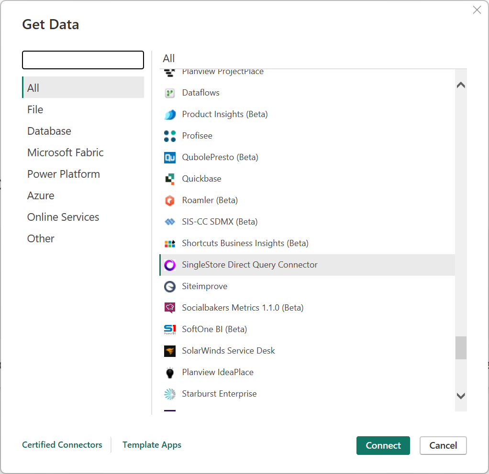
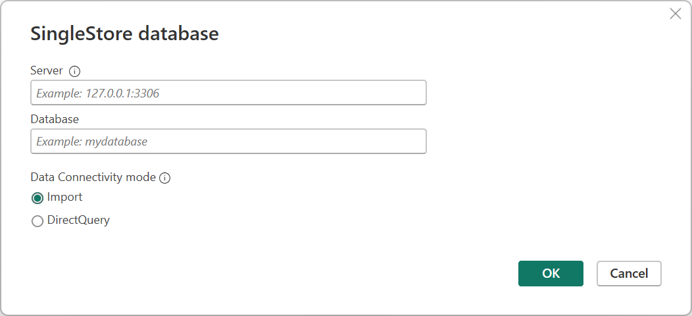
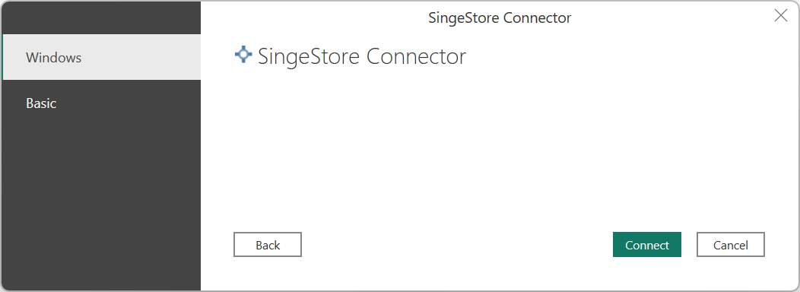
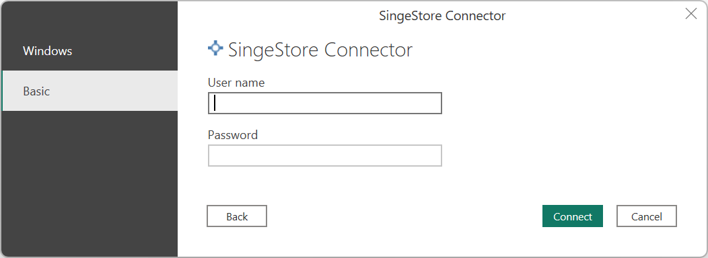

# SingleStore (Beta)

> [!NOTE]
> The following connector article is provided by SingleStore, the owner of this connector and a member of the Microsoft Power Query Connector Certification Program. If you have questions regarding the content of this article or have changes you would like to see made to this article, visit the SingleStore website and use the support channels there.

## Summary

| Item | Description
|--|--|
| Release State | Beta |
| Products | Power BI (Semantic models) Power BI (Dataflows) Fabric (Dataflow Gen2) |
| Authentication Types Supported | Basic Windows |

## Capabilities Supported

* Import
* DirectQuery (Power BI semantic models)

## Connect to SingleStore

To connect Microsoft Power BI Desktop to SingleStore DB or Managed Service:

1. In the **Home** ribbon, from the **Get Data** list, select **More**.

2. In the **Get Data** dialog, select **SingleStore Direct Query Connector 1.0**.

    

3. In the **SingleStore database** dialog box, enter the IP address or hostname of the SingleStore cluster in **Server**. In **Database**, enter the database name.

    Under **Data Connectivity** mode, select the Import or DirectQuery mode, and then select **OK**.

    

4. In the **SingleStore Direct Query Connector 1.0** dialog box, in the left pane, select the authentication type (either **Windows** or **Basic**).

    > [!NOTE]
    > SingleStoreDB Cloud users can only use **Basic** authentication.

    * For **Windows** authentication, [set up a SingleStore server for Kerberos authentication](https://docs.singlestore.com/db/v7.3/en/security/authentication/kerberos-authentication.html). Then select the **Connect** button.

       > [!NOTE]
       > You need to run Power BI with the user account that maps to the SingleStore DB user.

       

    * For **Basic** authentication, enter the username and password used to connect to SingleStore, and then select the **Connect** button.

       

5. Once authenticated&mdash;for Import or DirectQuery mode&mdash;in the **Navigator** dialog box, choose the desired tables and select the **Load** button.

    

You can now use Power BI to explore SingleStore data.

## Create a Custom SQL Report

> [!NOTE]
> Any user that creates a custom SQL report must only have read-only access to the SingleStore databases.

To create a new custom SQL report:

1. Open Power BI Desktop.

2. In the **Home** ribbon, from the **Get Data** list, select **Blank query**.

3. In the **Power Query Editor** dialog, specify the query in the following format:

    SingleStoreODBC.Query("\<_ip_address_or_hostname_>", "\<_database_>", "\<_query_>")

    Submit the query.

    > [!NOTE]
    > If you're using the server for the first time, select **Edit Credentials** and enter the credentials. Go to **Step 4** in [Connect to SingleStore](#connect-to-singlestore) for more information.

4. Verify the data to load, and select **Close & Apply**.

5. If you've worked with the semantic model before and it's cached in memory, refresh the report to reset the local cache. On the **Home** ribbon, select **Refresh**.

To update the existing custom SQL reports, select the **Refresh** button on the **Home** ribbon.

## Modify Credentials

To modify the credentials used to connect to SingleStore:

1. In the **File** ribbon, select **Options and settings** > **Data source settings**.

2. In the **Data source settings** dialog, select **SingleStore DirectQuery Connector 1.0**, and then select **Edit Permissions**.
